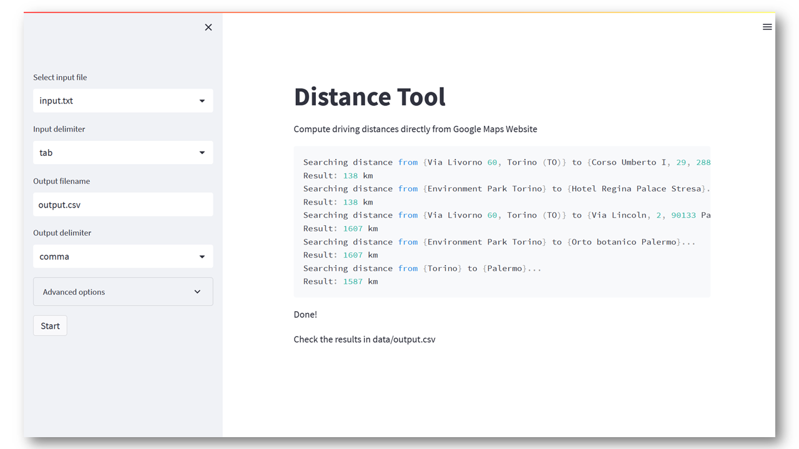

# distance-tool-with-automation

[](https://github.com/linomp/distance-tool-with-automation/actions/workflows/CI.yml)

## Installation

Pre-requisites:

- Python 3.10+
- pip 22.3+

Run the following commands to clone the project, create a virtual environment and install the project dependencies:

   ```shell
   git clone https://github.com/linomp/distance-tool-with-automation.git
   cd distance-tool-with-automation
   
   # Windows
   python -m venv venv
   call venv\Scripts\activate.bat
   
   # MacOS/Linux
   python3 -m venv venv
   source ./venv/bin/activate
      
   pip install --upgrade pip
   pip install -r requirements.txt
   playwright install chromium
   ```

## How to use:

1. Create an input `.txt` file containing two addresses per line (origin and
   destination), separated by a delimiter (e.g. comma, tab, semicolon).

   Here is an example of tab-delimited input file (`<TAB>` added for readability, normally they are not visible in the
   file):

    ```text
    Via Livorno 60, Torino (TO)<TAB>Corso Umberto I, 29, 28838 Stresa VB
    Environment Park Torino<TAB>Hotel Regina Palace Stresa
    Via Livorno 60, Torino (TO)<TAB>Via Lincoln, 2, 90133 Palermo PA
    Environment Park Torino<TAB>Orto botanico Palermo
    Torino<TAB>Palermo
    ```

   _Note: from Excel you can export an .xlsx as a tab-delimited .txt file_


2. Launch the app:
    ```bash
    # Windows/MacOS/Linux
    streamlit run app_ui.py
    ```
   Then visit http://localhost:8501/ to use the browser-based UI:
   <br/>
   <br/>
   

   <details>
      <summary>Or invoke the app from command-line (advanced)</summary>

      ```bash
      # Windows/MacOS/Linux
      python app.py -i data/input.txt -d "\t"
      
      # MacOS/Linux
      python3 app.py -i data/input.txt -d "\t"
      ```
   </details>

3. The tool will process the input file line-by-line, calculating the distance between every pair of addresses and
   writing the result in a `.csv` output file. The final result will look like this:

   

## Notifications (Optional)

The app has an optional notification feature (via telegram bot).

<details>
      <summary>Steps to enable it</summary>

1. Search for `@BotFather` in Telegram and follow the instructions to create a new bot.
2. Send a message to your bot and get your chat id by visiting this URL:
   `https://api.telegram.org/bot<your bot token>/getUpdates`
3. Create an .env file in the root directory of the project and add the following variables:
    ```bash
    TELEGRAM_TOKEN=<your bot token from step 1>
    TELEGRAM_CHAT_ID=<your chat id from step 2>
    ```
4. Check that it works. Run `pytest .` and you should see a message in the bot chat saying
   this : `Finished processing: test_input.txt`

Learn more [here](https://medium.com/codex/using-python-to-send-telegram-messages-in-3-simple-steps-419a8b5e5e2)
</details>

## Alternative

This [other version](https://github.com/linomp/distance-tool) gets the distances using the Google Maps Distance Matrix
API.

It offers a web-based UI and allows you to upload an excel file. However, it requires a Google Maps API key. The service
is free up to [~40K requests per month](https://mapsplatform.google.com/pricing/) but after that Google will start
charging you.
